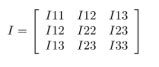

# Installing guide
Copy and Paste in a terminal:  
'''ruby
git clone https://github.com/RainerKuemmerle/g2o.git
cd g2o
mkdir build
cd build
cmake ../
make
'''  
# hands_on_Aug10
Step by step learning g2o optimization. 
## Input file format:
### VERTICES (lines starting with “VERTEX_SE2” in g2o): 
Description of the vertices of the pose graph: 
Each line follows the format: “ID x y th”, where “ID” is a unique index assigned to the corresponding pose,and “x”, “y”, “th” describe the initial guess (usually obtained from odometry) of the pose. “x” and “y” are the initial guess of node’s planar position, while “th” is the initial guess for node’s orientation (in radians); 
### EDGES (lines starting with “EDGE_SE2” in g2o): 
description of the edges of the pose graph. The ordering of the elements in the EDGES description becomes: “IDout IDindx dy dth I11 I12 I13 I22 I23 I33”. Moreover, the corresponding information matrices need to be changed.  

***
## Header files
A brief explanation on header files.  
## Factory.h
The Factory class is a crucial part of g2o's extensibility, allowing you to dynamically create different types of graph elements (vertices and edges) based on their associated tags. 
This is particularly useful for building and optimizing complex graph-based models used in robotics and computer vision applications. 
The macros provided simplify the registration and usage of these types, making it easier to extend the functionality of the g2o library.
### OptimizationFactory.h
The optimization_algorithm_factory.h header is part of the g2o library and is used for managing and creating instances of optimization algorithms for graph-based optimization problems. 
This header provides functionalities to construct and manage optimization algorithms that can be used with the SparseOptimizer class to solve different types of optimization problems.
The g2o library is designed to solve graph-based optimization problems, where 
Nodes represent variables and edges represent constraints between these variables. 
Optimization algorithms are responsible for iteratively updating the variables to minimize the error between the observed and predicted measurements.
This header provides a factory mechanism to create instances of various optimization algorithms. 
It allows you to dynamically select and configure different optimization algorithms for solving optimization problems.
#### Usage:
Constructing an Algorithm: The OptimizationAlgorithmFactory class in this header provides methods to construct optimization algorithms. You provide the name of the algorithm you want to create, and the factory constructs an instance of the corresponding algorithm.
Algorithm Properties: The factory also provides properties and information about available algorithms. These properties include algorithm names, descriptions, and other relevant information.
### sparse_optimizer.h
This header is also part of the g2o core module 
Defines the SparseOptimizer class, which is a central component  managing and solving optimization problems involving sparse graphs.
### command_args.h" 
This header [likely] contains utilities for parsing command-line arguments. It's used to handle command-line options and arguments passed to the program.
***
# Optimization options
**lm_var**[Levenberg-Marquardt], **gn_var**[Gauss-Newton (GN)], **dogleg**, **cg**[Conjugate Gradient], **cholmod**[Cholesky], **sparse_schur**[Sparse Schur], **pcg**[Preconditioned Conjugate Gradient].  
**solverProperty** is an instance of OptimizationAlgorithmProperty, which is a class provided by the g2o library to store properties of optimization algorithms.

